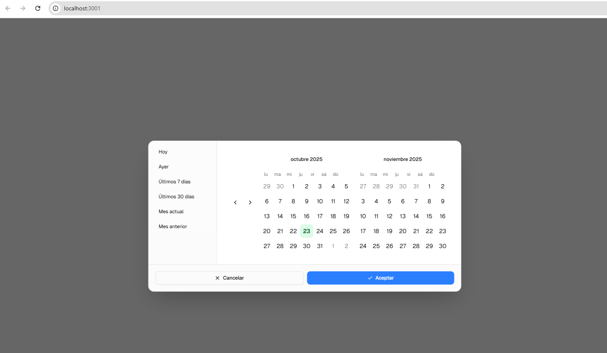
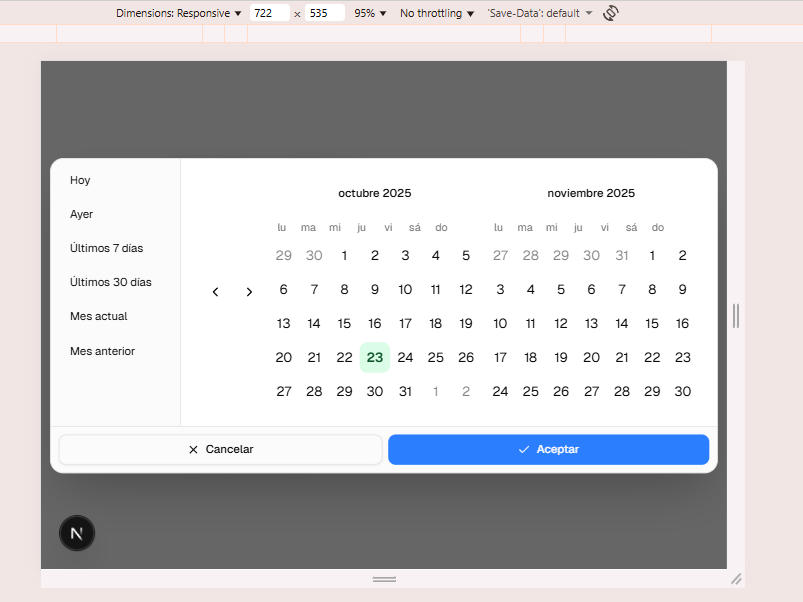
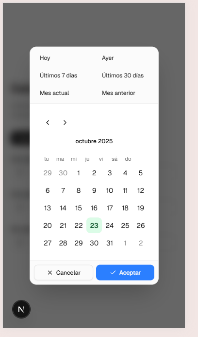
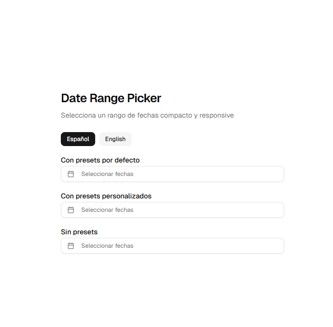

# 📅 Date Range Picker

A modern, responsive, and customizable date range picker component built with React, Next.js, and TypeScript. Features bilingual support (Spanish/English), preset date ranges, and beautiful animations.

## 🚀 Live Demo

**[View Live Demo](https://v0-date-range-picker-indol.vercel.app/)**

## ✨ Features

- 🌍 **Bilingual Support** - Spanish and English locales
- 📱 **Fully Responsive** - Optimized for desktop, tablet, and mobile
- 🎨 **Customizable Themes** - Custom colors for different day states
- ⚡ **Preset Ranges** - Quick selection for common date ranges
- 🎭 **Beautiful Animations** - Smooth transitions and hover effects
- ♿ **Accessible** - Built with accessibility in mind
- 🔧 **TypeScript** - Full type safety and IntelliSense support
- 🎯 **Modern Stack** - React 19, Next.js 16, Tailwind CSS

## 📸 Screenshots

### Desktop View


### Tablet View


### Mobile View


### Main Interface


## 🛠️ Tech Stack

- **Framework**: Next.js 16.0.0
- **UI Library**: React 19.2.0
- **Styling**: Tailwind CSS 4.1.9
- **Date Handling**: date-fns (latest)
- **Calendar**: react-day-picker (latest)
- **Icons**: Lucide React
- **UI Components**: Radix UI
- **Language**: TypeScript 5.9.3

## 🚀 Quick Start

### Prerequisites

- Node.js 18+ 
- pnpm (recommended) or npm

### Installation

1. **Clone the repository**
   ```bash
   git clone <repository-url>
   cd date-range-picker
   ```

2. **Install dependencies**
   ```bash
   pnpm install
   # or
   npm install
   ```

3. **Run the development server**
   ```bash
   pnpm dev
   # or
   npm run dev
   ```

4. **Open your browser**
   Navigate to [http://localhost:3000](http://localhost:3000)

## 📖 Usage

### Basic Implementation

```tsx
import { DateRangePicker } from "@/components/date-range-picker"
import type { DateRange } from "react-day-picker"

function MyComponent() {
  const [date, setDate] = useState<DateRange | undefined>()

  return (
    <DateRangePicker
      date={date}
      onDateChange={setDate}
      locale="es" // or "en"
    />
  )
}
```

### Advanced Configuration

```tsx
import { DateRangePicker, type DateRangePreset } from "@/components/date-range-picker"

const customPresets: DateRangePreset[] = [
  {
    label: "Last 7 days",
    getValue: () => ({
      from: subDays(new Date(), 6),
      to: new Date()
    })
  },
  {
    label: "This month",
    getValue: () => ({
      from: startOfMonth(new Date()),
      to: new Date()
    })
  }
]

function AdvancedExample() {
  return (
    <DateRangePicker
      date={date}
      onDateChange={setDate}
      locale="en"
      presets={customPresets}
      todayColor="bg-green-100 text-green-900"
      rangeColor="bg-blue-500 text-white"
      rangeMiddleColor="bg-blue-100 text-blue-900"
      showPresets={true}
      acceptText="Confirm"
      cancelText="Close"
    />
  )
}
```

### Custom Button Text

```tsx
function CustomButtonsExample() {
  return (
    <DateRangePicker
      date={date}
      onDateChange={setDate}
      locale="es"
      acceptText="Confirmar"
      cancelText="Cerrar"
      rangeColor="bg-purple-500 text-white"
    />
  )
}
```

## 🎨 Customization

### Props

| Prop | Type | Default | Description |
|------|------|---------|-------------|
| `date` | `DateRange \| undefined` | `undefined` | Selected date range |
| `onDateChange` | `(date: DateRange \| undefined) => void` | - | Callback when date changes |
| `locale` | `"en" \| "es"` | `"es"` | Language locale |
| `todayColor` | `string` | `"bg-green-100 text-green-900"` | Today's date color |
| `rangeColor` | `string` | `"bg-blue-500 text-white"` | Range selection color |
| `rangeMiddleColor` | `string` | `"bg-blue-100 text-blue-900"` | Middle range color |
| `normalDayColor` | `string` | `"text-foreground"` | Normal day color |
| `presets` | `DateRangePreset[]` | Default presets | Custom preset options |
| `showPresets` | `boolean` | `true` | Show/hide preset buttons |
| `acceptText` | `string` | `"Aceptar"/"Accept"` | Custom text for accept button |
| `cancelText` | `string` | `"Cancelar"/"Cancel"` | Custom text for cancel button |

### Default Presets

- **Today** - Current day
- **Yesterday** - Previous day  
- **Last 7 days** - Past week
- **Last 30 days** - Past month
- **Current month** - From start of month to today
- **Previous month** - Complete previous month

## 🎯 Features in Detail

### Responsive Design
- **Desktop**: Two-month calendar view with sidebar presets
- **Tablet**: Optimized layout with flexible preset arrangement
- **Mobile**: Single-month view with horizontal preset layout

### Accessibility
- Full keyboard navigation support
- ARIA labels and roles
- Focus management
- Screen reader compatible

### Internationalization
- Spanish and English support
- Date formatting according to locale
- Localized preset labels

## 🏗️ Project Structure

```
date-range-picker/
├── app/                    # Next.js app directory
│   ├── globals.css        # Global styles
│   ├── layout.tsx         # Root layout
│   └── page.tsx           # Demo page
├── components/            # React components
│   ├── date-range-picker.tsx  # Main component
│   ├── theme-provider.tsx     # Theme context
│   └── ui/               # UI components
│       ├── button.tsx
│       └── calendar.tsx
├── lib/                  # Utilities
│   └── utils.ts          # Helper functions
├── images/               # Screenshots
│   ├── main_screen.png
│   ├── mobile.png
│   ├── pc.png
│   └── tablet.png
└── styles/               # Additional styles
    └── globals.css
```

## 🚀 Deployment

### Vercel (Recommended)

1. Push your code to GitHub
2. Connect your repository to Vercel
3. Deploy automatically

### Other Platforms

```bash
# Build the project
pnpm build

# Start production server
pnpm start
```

## 🤝 Contributing

1. Fork the repository
2. Create your feature branch (`git checkout -b feature/amazing-feature`)
3. Commit your changes (`git commit -m 'Add some amazing feature'`)
4. Push to the branch (`git push origin feature/amazing-feature`)
5. Open a Pull Request

## 📝 License

This project is licensed under the MIT License - see the [LICENSE](LICENSE) file for details.

## 🆘 Support

If you have any questions or need help, please:

1. Check the [Issues](https://github.com/your-repo/issues) page
2. Create a new issue if your problem isn't already reported
3. Provide detailed information about your setup and the problem

## 🔗 Links

- **Live Demo**: [https://v0-date-range-picker-indol.vercel.app/](https://v0-date-range-picker-indol.vercel.app/)


---

<div align="center">

**Developed by [Intway Software](https://www.intway.com.ar)**

[](https://www.intway.com.ar)

</div>